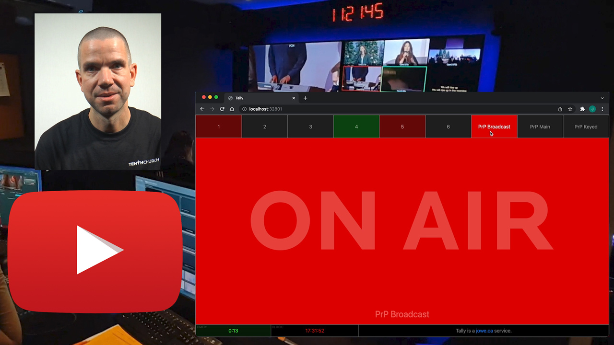
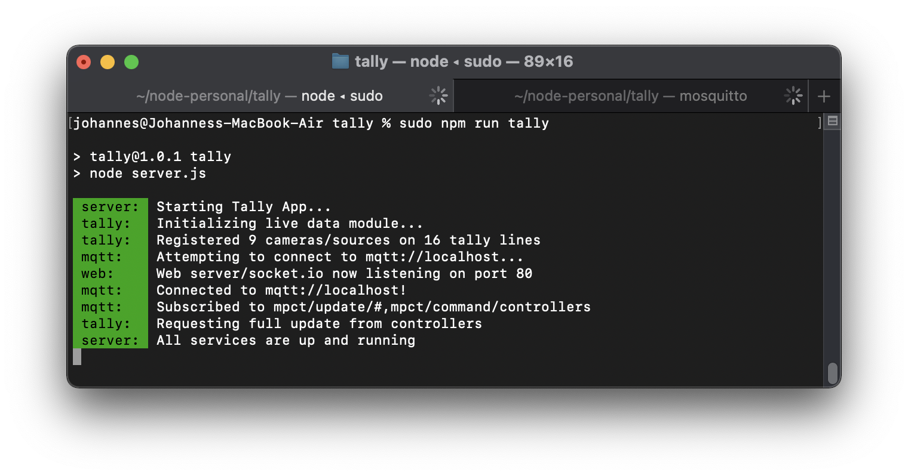
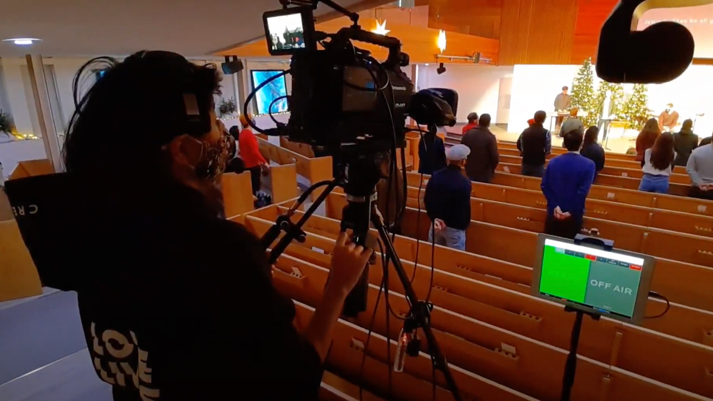
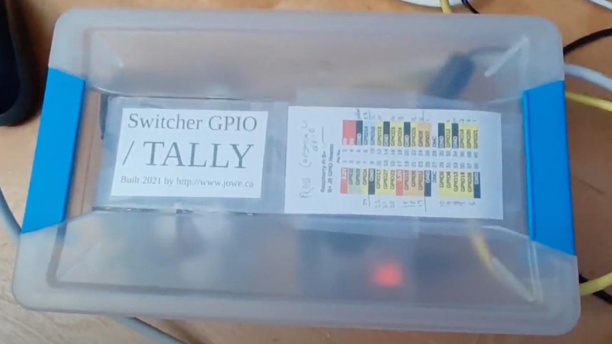
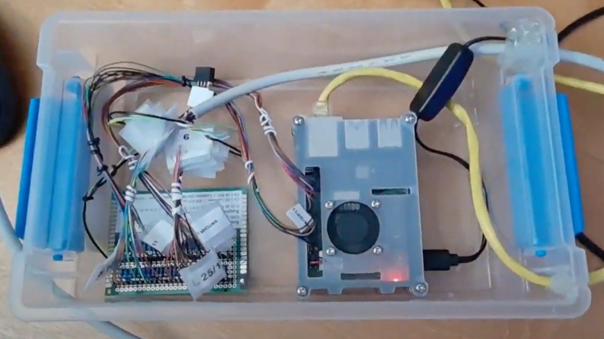

# Tally
## A Software Tally System for Broadcast Switchers

* Use your phone or other browser-enabled device to add a tally light to your camera or CG source
* Supports tallying preview and program for each source
* Supports tallying multiple devices side by side
* Fully responsive, super simple to use touch interface
* Developed for use with [Ross Carbonite Ultra](https://www.rossvideo.com/products-services/acquisition-production/production-switchers/carbonite-ultra/) (via GPIO), but can be used with any switcher that has a tally interface, when paired with circuitry that can communicate the tally data to [Raspberry PI GPIO](https://projects.raspberrypi.org/en/projects/physical-computing/)
* Integrates with [MPCT  production time / automation system](https://www.youtube.com/watch?v=Wu7vsRnQCIk)

## Watch Demo Video:
[](https://www.youtube.com/watch?v=30k-sjt_wY0)

## Install it:
```git clone http://github.com/jowe81/tally```

```cd tally```

```npm install```

## Configure it:
``` nano constants.js``` (from within the ```tally``` directory)

## Run it:
```npm run tally``` (or ```sudo npm run tally```, if you have configured express/the website to be served at port 80)




## Run the test file:
The test generates fake tally data, and only needs an MQTT broker to work.

```npm run test```

## Dependencies

### Hardware
For production use you will need a physical interface to bring tally data from your switcher onto the network. You can build this yourself or contact me for assistance.




### Packages
* [ejs](https://www.npmjs.com/package/ejs): ^3.1.6
* [express](https://www.npmjs.com/package/express): ^4.17.1
* [socket.io](https://www.npmjs.com/package/socket.io): ^4.4.0
* [@jowe81](https://www.npmjs.com/package/@jowe81/lg)/lg: ^1.0.0
* [mqtt](https://www.npmjs.com/package/mqtt): ^4.2.8

## Other Software

To actually use Tally, you will need to configure an [MQTT broker](http://mosquitto.org), an [MPCT controller](http://github.com/jowe81/mpctcontroller), and an [MPCT server](http://github.com/jowe81/mpctserver). These need to be properly referenced in [constants.js](./constants.js).

_Important: This is not trivial to set up, and the MPCT repos at this time do not include any instructions for setup. If you really want to try this out, please contact me at johannes@jowe.ca and I'll assist you._ 


## Changelog
* Version 1.0.2 (December 18, 2021)
  * Fix UI painting bug: tally data gets now painted properly immediately after adding or removing sources from the tallyboard
* Version 1.0.1 (December 12, 2021)
  * Selected tallies will now show up in the order they were added to the tallyboard (sources will be added to the right of the board instead of inserted by camera id)
* Version 1.0.0 (December 9, 2021)
  * Initial release

## About
I work as a technical director at [Tenth Church](http://www.tenth.ca) in Vancouver, Canada. We recently installed a broadcast video system. Some of our camera operators have expressed that a tally light would be helpful, and instead of trying to get funding for a commercial solution I decided to build one. The entire cost of the hardware for this was well below 100$ CDN, and one doesn't need to be an electronics geek to build this - just some soldering skills required.